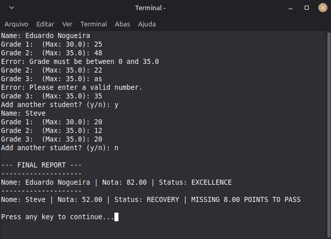

# 🎓 Student Grade Manager

A Java-based student management system developed to consolidate concepts of Object-Oriented Programming (OOP), Collections, and Data Validation.

---

## 🚀 Features

* **Dynamic Registration:** Register multiple students in a single execution using `ArrayList`.
* **Grade Validation:** Intelligent system that prevents negative grades or values above the allowed limits (**30.0** for the first grade and **35.0** for the others).
* **Error Handling:** Robust against invalid inputs (letters instead of numbers) using `try-catch` blocks.
* **Automatic Status (Enum):** Automatic student classification based on the final grade:
    * **EXCELLENCE:** 80 - 100 points.
    * **PASSED:** 60 - 79 points.
    * **RECOVERY:** 50 - 59 points (Calculates points needed to reach 60).
    * **FAIL:** Below 50 points.

## 🛠️ Technologies & Concepts

* **Java 17+**
* **Encapsulation:** Private attributes with controlled access via getters.
* **Enums:** Business logic and state management.
* **Collections (List/ArrayList):** Dynamic object storage.
* **Exception Handling:** Catching `InputMismatchException` to ensure system stability.
* **Clean Code:** Separated utility methods (`InputHelper`) to keep the code readable and reusable.

## 📋 How to Run

### Prerequisites
* **Java JDK 17** or higher installed.
* Terminal or Command Prompt access.

### Installation & Execution
1. **Clone the repository**
   ```bash
   git clone https://github.com/EduardoSNogueira/java-backend-journey
   ```

2. **Navigate to the project's root folder**
   ```bash
   cd java-backend-journey
   ```

3. **Compile all files at once**
   ```bash
    javac -d bin src/com/nogueira/application/Main.java src/com/nogueira/entities/*.java src/com/nogueira/utils/*.java src/com/nogueira/enums/*.java   
    ```

4. **Run the application**
   ```bash
   java -cp bin com.nogueira.application.Main
   ```

## 📸 Usage Example

Below is a demonstration of the application running, showing the dynamic student registration and the final report.


---