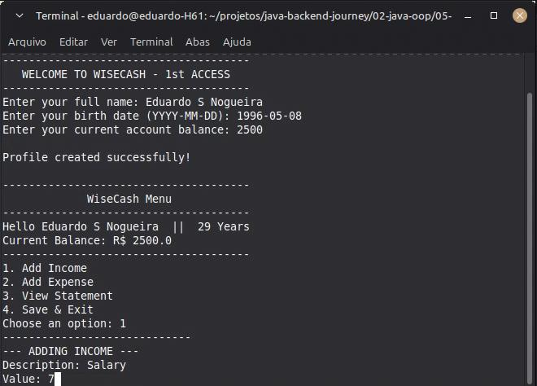

# 💰 WiseCash - Personal Finance Management System (CLI)

**WiseCash** is a command-line interface (CLI) application developed in **Java** to assist with personal financial control. The primary focus of this project is to apply the fundamentals of **Object-Oriented Programming (OOP)** and **data persistence** in backend systems.

---

## 🚀 Technologies

* **Language:** Java 17+
* **Persistence:** CSV (Comma-Separated Values) files
* **Environment:** Linux Mint (XFCE)
* **Build Tool:** Java Compiler (javac) / IDE (IntelliJ or VS Code)

---

## 🛠️ Features

- [x] **Profile Management:** Create a user profile with automatic age calculation and initial balance setup.
- [x] **Income Tracking:** Add financial entries with descriptions and values.
- [x] **Expense Management:** Categorize spending (Food, Transport, Leisure, etc.).
- [x] **Detailed Statement:** View all transactions with an updated final balance.
- [x] **Data Persistence:** All data is automatically saved to `.csv` files, ensuring information is retained after closing the program.

---

## 🧠 Software Engineering Concepts Applied

This project was built to demonstrate technical maturity in the following areas:

1.  **Encapsulation:** Protecting entity data (User, Transaction) using access modifiers and getter/setter methods.
2.  **Business Logic:** Implementation of conditional flows for real-time balance calculations (additions and subtractions).
3.  **File Handling (I/O):** Logic for reading and writing structured data efficiently.
4.  **Code Organization:** Separation of concerns to ensure clean, maintainable, and readable code.

---
📈 Roadmap
- [x] Transition to a REST API using Spring Boot 3.x.
- [x] Database integration with PostgreSQL.
- [x] Implementation of JWT Security for authentication.
- [x] Monthly report generation in PDF format.
---
## 📸 Usage Example

Below is a demonstration of the application running, showing the dynamic student registration and the final report.

---
🤝 Contact
Eduardo S Nogueira Software Engineering Student (IESB) 📍 Brasília, Brazil.
---